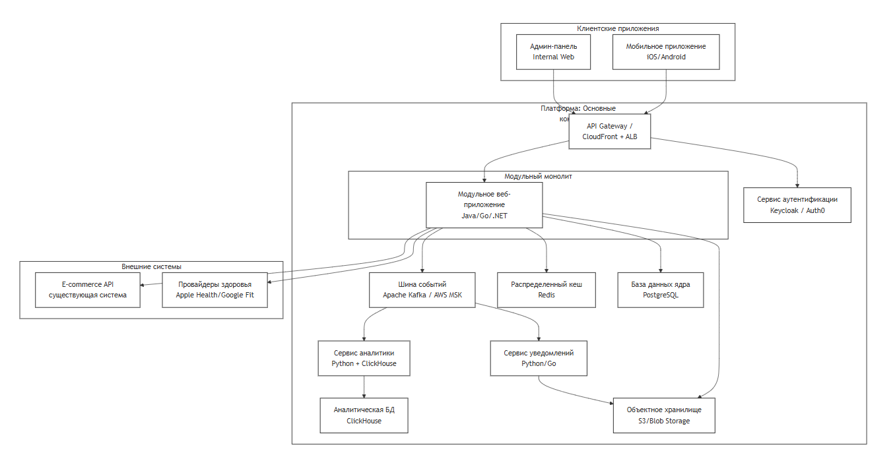

## 13. Базовая архитектура с учётом ограничений бизнес-требований, НФТ, выбранной архитектуры, адресация атрибутов качества

### Базовая архитектура (Baseline Architecture)
**Фокус**: Минимально жизнеспособный продукт (MVP), который реализует критические бизнес-сценарии (персональный трекер, износ экипировки, рекомендации к покупке) и удовлетворяет ключевым НФТ (безопасность, наблюдаемость, интеграция), используя выбранную стратегию «модульный монолит с шиной событий».

### 1. Логическая диаграмма контейнеров (C4 Container)

### 2. Детализация ключевых компонентов
#### 2.1. Модульный монолит (Core App)
* Технология: Один исполняемый файл (например, Spring Boot, Go service). Внутри — чёткие модули:
* * user_profile: Регистрация, профиль, настройки конфиденциальности.
* * workout_tracker: Запись, сохранение, базовый анализ тренировок.
* * gear_inventory: Ведение каталога экипировки пользователя, расчёт износа.
* * social_graph: Друзья, подписки, базовые группы (в памяти или БД).
* * internal_api: REST API для мобильного клиента.
* Почему модульный монолит: Позволяет быстро запустить MVP с транзакционной целостностью (ACID), простым деплоем и отладкой. Чёткие границы модулей готовят почву для будущего расщепления.
* Адресация НФТ:
* * Аутентификация делегирована внешнему сервису (AUTH_SVC). Шифрование чувствительных полей в БД.
* * Использование Redis для кеширования горячих данных (профили, инвентарь).
* * Клиент для ECOM_API с Circuit Breaker (Hystrix/Resilience4j) и кешированием каталога.

#### 2.2. Шина событий (Apache Kafka)
* Роль: «Нервная система» для асинхронной коммуникации и будущей эволюции.
* Ключевые топики на старте:
* * user.registered (для аналитики и welcome-письма)
* * workout.completed (для геймификации, аналитики, рекомендаций)
* * gear.wear_threshold_reached (для триггера уведомлений о замене)
* Адресация НФТ:
* * Изолирует сбои в потребителях (NOTIFY_SVC) от основного приложения.

#### 2.3. Отдельные сервисы (вынесены сразу из-за специфики)
* Сервис аутентификации (AUTH_SVC): Используется готовое решение (Keycloak). Отвечает за OAuth 2.0, JWT, SSO с e-commerce.
* Сервис уведомлений (NOTIFY_SVC): Подписывается на Kafka. Отправляет push (Firebase/APNs), email, SMS. Имеет шаблоны.
* Сервис аналитики (ANALYTICS_SVC): Подписывается на Kafka, агрегирует данные в ClickHouse для быстрых дашбордов (WAU, активность).

#### 2.4. Хранилища данных
* PostgreSQL (DB_CORE): Основная транзакционная БД. Схемы соответствуют модулям монолита.
* Redis: Кеш сессий, кеш ленты (на потом), кеш каталога товаров от ECOM_API.
* ClickHouse (DB_ANALYTICS): Для агрегированной аналитики и быстрых отчетов для маркетинга.
* S3: Хранение GPX-треков, аватаров, медиа из постов.

### 3. Адресация атрибутов качества и рисков

|Атрибут / Риск| Как адресован в базовой архитектуре|
|--|---------------------------------------|
|Безопасность|• AUTH_SVC (Keycloak) — централизованный контроль. • API Gateway — точка входа с WAF и rate limiting. • Шифрование PII в DB_CORE на уровне приложения. • Все внутренние коммуникации в приватных подсетях.|
|Надёжность 99.9% |• Монолит + БД развернуты в двух Availability Zones с балансировщиком. • Kafka обеспечивает сохранность событий при сбоях потребителей. • Health checks и auto-recovery в Kubernetes/ECS.|
|Пиковая нагрузка 10к сессий|• Вертикальное и горизонтальное масштабирование монолита (2-4 инстанса). • Redis снимает нагрузку с БД на чтение профиля/инвентаря. • Асинхронная запись тяжелых данных (треки в S3, события в Kafka).|
|Интеграция с e-commerce|• Circuit Breaker в модуле gear_inventory при вызове ECOM_API. • Кеш товаров в Redis (TTL 5 мин) для отказоустойчивости. • Событие purchase.completed из ECOM_API попадает в Kafka для обновления инвентаря.|
|Наблюдаемость|• Обязательное structured logging (JSON) из монолита в центральный Loki. • Метрики (Prometheus) со всех контейнеров и БД. • Distributed tracing (Jaeger) от API Gateway через весь монолит.|
|Глобальность|Пока не адресована в MVP. Архитектура заточена под один регион. Но: • CDN (CloudFront) для статики клиента. • Геошардинг не делаем, но проектируем модуль user_profile с полем home_region.|

### 4. Критические технические решения и компромиссы
*  Компромисс: Единая БД для всех модулей.
* * Плюс: Простота, транзакции, joins между данными пользователя и тренировок.
* * Минус: Скрытая связность, риск «расползания» модулей.
* * Митагейшн: Строгий запрет на межмодульные JOIN на уровне кода. Общение через API модуля или через события (Kafka).
* Решение: События пишутся в Kafka синхронно в рамках транзакции БД.
* * Паттерн: Transactional Outbox (или использование Debezium для CDC).
* * Зачем: Гарантия, что бизнес-событие (например, workout.completed) не потеряется, даже если монолит упал сразу после коммита в БД.
* Решение: Отдельный сервис уведомлений с самого начала.
* * Зачем: Рассылка email/push — это side-effect, который не должен влиять на отклик основного API. Позволяет легко менять провайдеров и добавлять сложные логики таргетинга.

### 5. План эволюции (намеченный в архитектуре)
* Шаг 1 (Запуск MVP): Работает схема выше.
* Шаг 2 (Первое расщепление): При росте нагрузки workout_tracker и social_graph выделяются в отдельные микросервисы. Они начинают потреблять события из Kafka и имеют свои БД.
* Шаг 3 (Глобализация): Добавляется геошардинг для user_profile и workout_tracker. Внедряется сервис feature_flags для управления функциональностью по регионам.
* Шаг 4 (Оптимизация ленты): social_graph переводится на графовую БД (Neo4j), для ленты внедряется CQRS с отдельной read-моделью.

