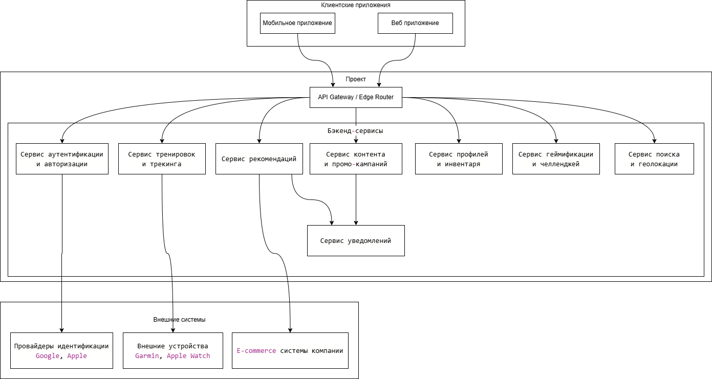

## Концептуальная архитектура

### Архитектурное Видение и Стратегия
Мы строим глобальную, социально-ориентированную спортивную платформу, основанную на принципах событийно-ориентированной (Event-Driven) микросервисной архитектуры. Это позволит:
- Масштабироваться независимо по функциональным доменам.
- Обеспечить отзывчивость через асинхронную обработку.
- Легко интегрироваться с внешними и внутренними системами.
- Поддерживать глобальную низкую задержку через географически распределенное развертывание.

#### Ключевые архитектурные решения, вытекающие из интересов стейкхолдеров:
- Для скорости выхода начнем с модульного монолита для ядра, но с четкими границами доменов, чтобы позже эволюционировать в микросервисы.
- Для глобальности и скорости критичные для задержки сервисы будут развернуты в нескольких регионах.
- Для конфиденциальности данные будут сегментированы по юрисдикциям. Внедрим централизованный сервис управления согласиями.
- Для персонализации и продаж, создадим отдельный сервис, который будет питать сервис рекомендаций и систему промо-кампаний.

### Диаграмма Контейнеров

### Описание ключевых контейнеров и их ответственности

#### Клиентские приложения
- Мобильное приложение: Основной канал взаимодействия для пользователей. Отвечает за трекинг, соц. ленту, уведомления.
- Веб-приложение: Для углубленной аналитики, управления профилем, просмотра контента. Меньше focus на трекинге.

#### Шлюз и безопасность
- API Gateway: Единая точка входа. Маршрутизация, ограничение запросов (rate limiting), кэширование ответов, терминация TLS. Ключевой элемент для обеспечения low latency (развернут в edge-локациях).

#### Бэкенд-сервисы
- Сервис аутентификации: Управляет сессиями, JWT-токенами, интеграцией с OAuth-провайдерами. Хранит учетные данные.
- Сервис профилей и инвентаря: Управляет данными пользователя, настройками конфиденциальности, инвентарем экипировки. Интегрируется с Consent Service.
- Сервис тренировок: Ядро системы. Принимает данные с устройств, хранит историю, вычисляет метрики, обеспечивает сравнение.
- Сервис геймификации: Обрабатывает события от других сервисов, вычисляет прогресс в челленджах, начисляет очки, разблокирует достижения. Высоконагруженный, событийно-ориентированный.
- Сервис поиска и геолокации: Обеспечивает поиск пользователей, групп, маршрутов. Обрабатывает геоданные (поиск тренирующихся рядом).
- Сервис контента и кампаний: Управляет промо-акциями, новостями, статическим контентом. Имеет API для маркетинговой команды. Таргетирует контент на основе данных из Data Pipeline.

#### Инфраструктурные и сквозные сервисы
- Сервис уведомлений: Подписывается на Event Bus и рассылает push-уведомления, emails, SMS через внешние провайдеры.
- Сервис рекомендаций: Анализирует поведение пользователя и данные из Data Pipeline, чтобы рекомендовать друзей, группы, тренировки и товары.
