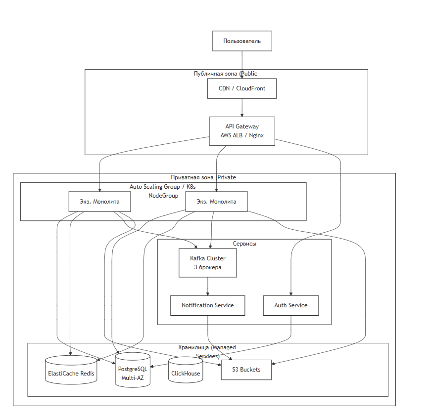

## d. Инфраструктурное представление 
**Цель**: Показать, как компоненты развернуты в runtime-окружении.

**Для кого**: DevOps/SRE, архитекторы.

**Топология развертывания (MVP, один регион)**:

**Ключевые инфраструктурные решения**:
* Контейнеризация: Все сервисы и монолит упакованы в Docker-контейнеры.
* Оркестрация: Kubernetes (или AWS ECS) для управления жизненным циклом, health checks, rolling updates.
* Сеть: VPC с публичными и приватными подсетями. Все БД и внутренние сервисы — в приватных.
* Управление конфигурацией: Конфиги (ключи API, URL БД) через Hashicorp Vault или секреты K8s.
* CI/CD: GitLab CI / GitHub Actions. Автоматический деплой в staging/prod при мерже в main.
